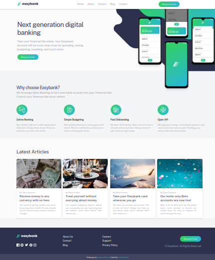
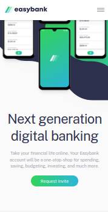
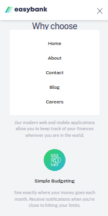
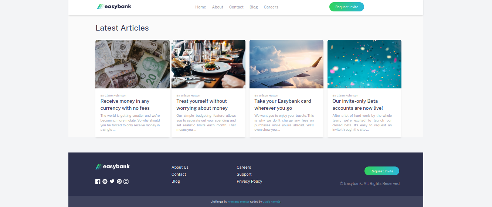

<h1 align="center">Easybank Landing Page</h1>

</img>

   Challenge by  <a href="https://www.frontendmentor.io?ref=challenge" target="_blank">frontendmentor.io</a>. Coded by <a href="https://guidofamula.com">Guido Famula</a>.

  <h3>
    <a href="https://www.frontendmentor.io/solutions/order-summary-component-oThH3-g4cJ" target='_blank' color="white">
      Solution URL
    </a>
   ~||~     <a target='_blank' href="https://guidofamula.github.io/easybank-landing-page-frontendmentor">
      Live URL
    </a>
   ~||~     <a target='_blank' href="https://www.frontendmentor.io/challenges/easybank-landing-page-WaUhkoDN">
      Challenge URL
    </a>
  </h3>

 
 

## Table of contents

- [Overview](#overview)
  - [The challenge](#the-challenge)
  - [Screenshots Version](#screenshots-version)
- [My process](#my-process)
  - [Built with](#built-with)
  - [Useful resources](#useful-resources)
- [Author](#author)
- [Acknowledgments](#acknowledgments)

## Overview

### The challenge

Users should be able to:

- View the optimal layout for the site depending on their device's screen size
- See hover states for all interactive elements on the page

### Screenshots Version

<h2>Mobile version</h2>

</img>

 
<h2>Navbar Sticky(toggle) on mobile</h2>

</img>

 
<h2>Navbar Sticky on desktop</h2>

</img>

## My process

### Built with

- Semantic HTML5 markup
- CSS custom properties
- Flexbox
- CSS Grid
- Mobile-first workflow
- [React](https://reactjs.org/) - JS library
- [Typescript](https://www.typescriptlang.org) - Javascript Superset
- [Vite](https://vitejs.dev/) - Module Bundler
- [Tailwind CSS](https://tailwindcss.com/) - For styles

### Useful resources

- [Tailwind Cheatsheet](https://tailwindcomponents.com/cheatsheet/) - This is an amazing reference which helped me guiding the design. I'd recommend it to anyone still learning this reference, like choosing pixel, setup grid, flex etc.

## Author

- My Website - [GUIDOFAMULA.COM](https://guidofamula.com)
- Frontend Mentor - [@guidofamula](https://www.frontendmentor.io/profile/guidofamula)
- Linkedin - [Guido Famula](https://www.linkedin.com/in/guido-famula/)

## Acknowledgments

Thank you to all my friends or frontend mentor friends who often give me advice and guidance, so that I am more motivated and focused on living my activities as a frontend developer.
